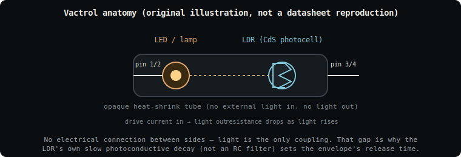

# 🔦 Vactrols — a light-physics field guide

> *A vactrol is two components that have never touched, whispering to each*
> *other in light instead of wire.*

This is a fork of [`soemdsp-sandbox`](https://github.com/soundemote/soemdsp-sandbox)
that gives its **Vactrol Envelope** modules (🐢 `VTL5C3` and 🐌 `VTL5C4`) real
light-physics grounding: what a vactrol physically is, why it sounds the way
it does, how that maps onto the module's knobs, and where the numbers came
from.

## 🔊 Listen: real-hardware vactrol recordings

Three takes on the same real vactrol under CV control — the fast turn-on /
slow, lingering release you hear is exactly the asymmetric photoconductive
persistence described below. Not a filter sweep, not an envelope generator —
just a photoresistor genuinely taking its time to let go of the light it
saw. 🎧

- 🎛️ **[`vactrol_speed_test(cv).wav`](https://drive.google.com/file/d/1pIIddKLbYH8M8E1G6PcH-F1zifknBiIn/view?usp=drive_link)**
  — driven directly by CV, the baseline response.
- 🐌 **[`vactrol_speed_test(slow).wav`](https://drive.google.com/file/d/1q3_TV43KSkOH8tFBpTcoBHg0cgvoh4CY/view?usp=drive_link)**
  — the same cell pushed toward its slow, swelling release.
- 🐢 **[`vactrol_speed_test(fast).wav`](https://drive.google.com/file/d/11xbIYxlobjik55lM_NmLfSVu7C5XClt2/view?usp=drive_link)**
  — and toward its fast, plucky release, for comparison.

And two demos of the **Buchla-style resonant low-pass gate** ([why LPGs love
vactrols](#️-why-lpgs-love-vactrols)) in its two modes — bandpass and
lowpass — showing the same vactrol simultaneously shaping amplitude and
timbre from one control signal:

- 🎚️ **[`buchla_badpass.flac`](https://drive.google.com/file/d/1ZNMxsp3G-EnbpTmFFS3RJ9u1PjOVMTsJ/view?usp=drive_link)**
  — Buchla-style bandpass LPG mode.
- 🎚️ **[`Buchla-LoPass.flac`](https://drive.google.com/file/d/1ae_8SFkIKIuHRL0LX35xUoCySTBnDLQQ/view?usp=drive_link)**
  — Buchla-style lowpass LPG mode.

> ⚖️ "Buchla" is used here purely descriptively, to name a well-known circuit
> topology (the resonant low-pass gate) associated with that historic design
> style — not as a claim of association. This project and these recordings
> are **not affiliated with, endorsed by, or sponsored by Buchla Electronic
> Musical Instruments** or any successor entity.

---

## 📖 Table of contents

- [🔊 Listen: real-hardware vactrol recordings](#-listen-real-hardware-vactrol-recordings)
- [🕯️ What is a vactrol?](#️-what-is-a-vactrol)
- [🧪 The physics in one paragraph](#-the-physics-in-one-paragraph)
- [📐 Anatomy](#-anatomy)
- [⏱️ Fast vs. slow: VTL5C3 vs VTL5C4](#️-fast-vs-slow-vtl5c3-vs-vtl5c4)
- [📊 Full VTL5C-series comparison table](#-full-vtl5c-series-comparison-table)
- [🎛️ How this maps to the sandbox module](#️-how-this-maps-to-the-sandbox-module)
- [🧮 The DSP model](#-the-dsp-model)
- [🎚️ Why LPGs love vactrols](#️-why-lpgs-love-vactrols)
- [📚 Scientific papers & primary sources](#-scientific-papers--primary-sources)
- [💬 Community references](#-community-references)
- [⚖️ A note on naming & IP](#️-a-note-on-naming--ip)

---

## 🕯️ What is a vactrol?

A **vactrol** (portmanteau of *vacuum* + *photoresistor*, though there's no
vacuum involved — the name just stuck) is an **opto-isolator built from an
LED (or incandescent lamp) optically coupled to a CdS photoresistor (LDR)**,
sealed together inside a light-tight tube with **zero electrical connection**
between the two halves. 🚫🔌

You drive the LED with a control-voltage-derived current. The LED glows. The
photocell "sees" that light and its resistance drops. Nothing about that
resistance change is instantaneous or linear — and that imperfection is
*exactly* why synth designers love it.

## 🧪 The physics in one paragraph

CdS (cadmium sulfide) photoresistors follow a **power-law relationship**
between illuminance and resistance:

```
R(lux) ∝ Lux^(−γ)
```

...where `γ` (the *photoconductive gamma*) typically sits around **0.7–0.9**
for real cells. But the *really* musically useful part is the **asymmetric
time response**: charge carriers in the CdS crystal get freed almost
instantly when light hits (fast **attack**), but *linger*, trapped in
crystal defect states, for a comparatively long time after the light is gone
(slow **release**). This is a real solid-state phenomenon called
**photoconductive persistence** — it is not a capacitor, there is no RC
network, and yet it behaves like a smoothing filter purely because of how
charge carriers de-trap over time. ⚡➡️🐌

## 📐 Anatomy



Two components, one tube, one beam of light between them. That's the whole
circuit. The complete lack of electrical coupling is also why vactrols are
prized for **galvanic isolation** in non-audio contexts (relays, medical
equipment) — the audio/synth use is almost a happy side effect of a
component designed for something else entirely. 🧰

## ⏱️ Fast vs. slow: VTL5C3 vs VTL5C4


| | 🐢 VTL5C3 | 🐌 VTL5C4 |
|---|---|---|
| **Character** | Fast, percussive, "plucky" | Slow, swelling, "breathing" |
| **Turn-on (attack, 63%)** | ~2.5 ms | ~6.0 ms |
| **Turn-off (release, to 100 kΩ)** | ~35 ms | **~1.5 s** (≈40× slower) |
| **Dark resistance (min)** | 10 MΩ | 400 kΩ |
| **Typical use** | Buchla/Serge-style resonant LPG "pop" | Long pads, compressor-like glide |
| **Synth-DIY reputation** | *The* standard LPG vactrol | *The* slow alternative |

The eye-catching number is the release time: **VTL5C4 takes roughly 40×
longer than VTL5C3 to let go of a sound.** Same physical mechanism, same
package, wildly different musical personality — just because the CdS cell
inside was doped/processed differently. 🎨

## 📊 Full VTL5C-series comparison table

All figures below are drawn from the official **PerkinElmer Optoelectronics**
datasheets for the VTL5C-series axial vactrols (see
[Sources](#-scientific-papers--primary-sources)). "Turn-on" is time to 63% of
final `R_ON` after a 40 mA drive pulse; "turn-off" is time to reach 100 kΩ
(or as noted) after the pulse ends.

| Part | R_ON @1/10/40 mA | R_OFF (dark, min) | Dynamic range | Turn-on (63%) | Turn-off |
|---|---|---|---|---|---|
| VTL5C1 | 20 kΩ / 600 Ω / 200 Ω | 50 MΩ | 100 dB | 2.5 ms | 35 ms |
| VTL5C2 | 5.5 kΩ / 800 Ω / 200 Ω | 1 MΩ | 69 dB | 3.5 ms | 500 ms |
| **VTL5C3** | 30 kΩ / 5 Ω / 1.5 Ω | 10 MΩ | 75 dB | **2.5 ms** | **35 ms** |
| **VTL5C4** | 1.2 kΩ / 125 Ω / 75 Ω | 400 kΩ | 72 dB | **6.0 ms** | **1.5 s** |
| VTL5C6 | 75 kΩ / 10 kΩ / 2 kΩ | 100 MΩ | 88 dB | 3.5 ms | 50 ms (→1 MΩ) |
| VTL5C7 | 5 kΩ@0.4mA / 1.1 kΩ@2mA | 1 MΩ | 75 dB | 6 ms | 1 s (→100 kΩ) |
| VTL5C8 | 4.8 kΩ / 1.8 kΩ / 1 kΩ | 10 MΩ | 80 dB | 4 ms | 60 ms |
| VTL5C9 | 630 Ω @ 2 mA | 50 MΩ | **112 dB** | 4 ms | 50 ms |
| VTL5C10 | 400 Ω @ 1 mA | 400 kΩ | 75 dB | 1 ms | 1.5 s |

> 🐢 = fast-decay family (VTL5C1, C3, C6, C8, C9) — the "pluck" vactrols.
> 🐌 = slow-decay family (VTL5C2, C4, C7, C10) — the "swell" vactrols.

## 🎛️ How this maps to the sandbox module

Both `VTL5C3` and `VTL5C4` in the module browser share **one WASM DSP
implementation** (`native_modules/vactrol_envelope`) — they're not two
separate circuits, they're one envelope-follower parameterized differently,
exactly like the real parts are one CdS-cell design binned into different
speed grades. 🏭

| Knob (0–1 normalized, unchanged) | Readout shows | Real-world meaning |
|---|---|---|
| **Attack** | milliseconds | Time constant while the target gets *brighter* |
| **Release** | milliseconds | Time constant while the target gets *dimmer* |
| **Curve** | γ (LDR gamma) | Photoconductive exponent shaping the response |
| **Sensitivity** | lux full-drive | Illuminance needed to hit 100% conductance |
| **Light Offset** | lux bias | Ambient light added before the target is clamped |
| **Dark Current** | kΩ dark R | Leakage / floor when the cell sees no light at all |

The knobs themselves stay plain 0–1 automation values (so patches, MIDI
mapping, and macros all keep working normally) — only the **readout text**
translates them into numbers a vactrol datasheet reader would recognize.
See [`node-graph-module-definitions.js`](public/node-graph-module-definitions.js)
for the `displayTransform` functions that do this.

## 🧮 The DSP model

```
target       = clamp(light × sensitivity + lightOffset, 0, 1)
coefficient  = target > raw  ?  1 − e^(−1 / (attack  × sampleRate))
                              :  1 − e^(−1 / (release × sampleRate))
raw         += (target − raw) × coefficient
shaped       = raw ^ curve
out          = clamp(darkCurrent + shaped × (1 − darkCurrent), 0, 1)
```

This is a standard **one-pole exponential follower with separate attack/
release coefficients**, plus a power-law shaping stage (`raw ^ curve`) that
stands in for the CdS cell's photoconductive gamma, and a floor term
(`darkCurrent`) for the cell's non-zero dark leakage. It's the same overall
shape used by the DAFx-2013 Buchla LPG model below, simplified for real-time
use. The native WASM build uses a fast bit-manipulation `pow()`
approximation (accurate to a few percent — plenty for a *shaping curve*, not
a measurement instrument) since a `-nostdlib` freestanding build has no
`libm` to call into.

## 🎚️ Why LPGs love vactrols

A **low-pass gate** (LPG) — the signature Buchla/Serge sound-shaping element
— uses a *single* vactrol to simultaneously control **amplitude and filter
cutoff** from one control signal, because both effects come from the exact
same physical resistance change. Turn down the light, the cell resists more,
and *both* loudness and brightness fall together — the way a **struck,
damped physical object** naturally loses volume and brightness at the same
time. That's why LPG-driven plucks sound so organic compared to a separate
VCA + VCF: it's one physical process, not two circuits pretending to agree.
🔔➡️🔕

## 📚 Scientific papers & primary sources

- **PerkinElmer Optoelectronics** — *Low Cost Axial Vactrols VTL5C1, VTL5C2*
  datasheet.
  [farnell.com/datasheets/87223.pdf](https://www.farnell.com/datasheets/87223.pdf)
- **PerkinElmer Optoelectronics** — *Low Cost Axial Vactrols VTL5C3, VTL5C4*
  datasheet.
  [Xvive/Synthrotek mirror](https://store.synthrotek.com/assets/images/XVIVE-VTL5C3-VTL5C4-Vactrol-Data-Sheet.pdf)
- **PerkinElmer Optoelectronics** — *Analog Optical Isolators — VTL5C Series*
  full-family summary table.
  [uk-electronic.de/PDF/VTL.pdf](http://www.uk-electronic.de/PDF/VTL.pdf)
- **Silonex** — NSL-32SR2 datasheet (a modern successor part in the same
  photoresistor lineage after Silonex acquired the vactrol product line).
- Parker, J., Esqueda, F., Bilbao, S. — *"A Digital Model of the Buchla
  Lowpass-Gate"*, **Proc. of the 16th Int. Conference on Digital Audio
  Effects (DAFx-13)**, Maynooth, Ireland, 2013. Measured a real VTL5C3/2 at
  ~12 ms rise / ~250 ms decay — notably slower than the PerkinElmer spec,
  likely due to unit-to-unit variance or a different-generation part; a good
  reminder that datasheet *typicals* and *real components* diverge. 🔬
- General background: **Kasap, S. O.**, *Optoelectronics and Photonics:
  Principles and Practices* — standard reference for photoconductor gain,
  persistence, and trap-state physics in CdS/CdSe cells.

## 💬 Community references

- [ModWiggler — "Vactrols: slow or fast?"](https://www.modwiggler.com/forum/viewtopic.php?t=58076)
- [ModWiggler — "Speed/decay-tail of VTL5C3/2 (particularly Xvive)"](https://www.modwiggler.com/forum/viewtopic.php?t=222441)
- [clsound.com — VC Resonant LPG build doc](http://clsound.com/vcresonantlpg.html)
  (explicit VTL5C3 "fast"/VTL5C4-2 "slow" build guidance — the source for
  calling these "the" standard fast/slow pair)
- [modularsynthesis.com — hand-measured VTL5C3/VTL5C4 samples](https://modularsynthesis.com/vactrols/vactrols.htm)

## ⚖️ A note on naming & IP

`VTL5C3`/`VTL5C4` are PerkinElmer/Excelitas part numbers, used here purely
as **descriptive, nominative labels** — the same way a pedal calling itself
"808-style" or "Moog-style" is describing a sound, not claiming to *be* the
original part. No PerkinElmer code, schematics, or datasheet artwork is
reproduced anywhere in this repository; the DSP model and both diagrams on
this page are original work built from publicly published timing and
resistance figures. This project is **not affiliated with or endorsed by
PerkinElmer or Excelitas**. 🙏

---

*Made with 🔦, ☕, and an unreasonable amount of respect for a component*
*that does audio-rate envelope following by literally glowing at itself.*

---

